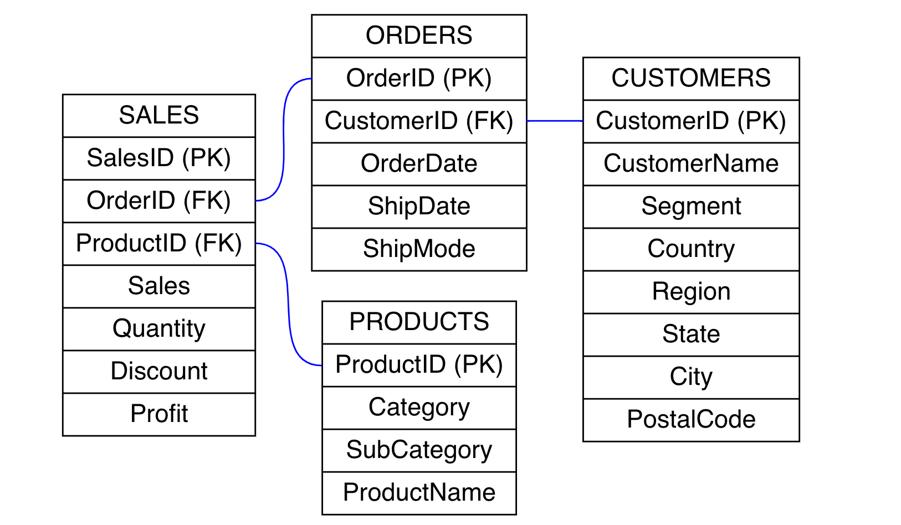
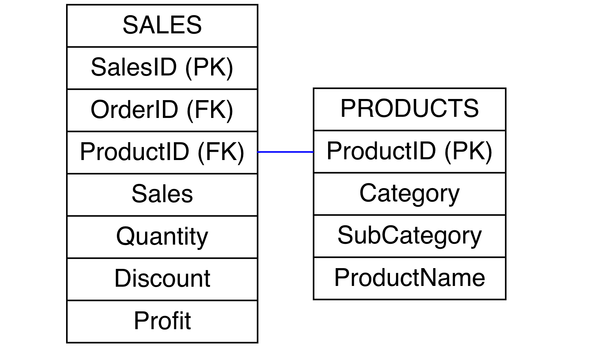
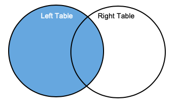
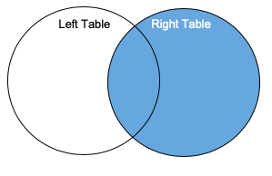
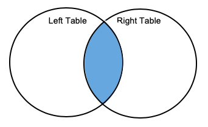
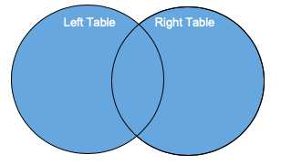

<link rel="stylesheet" href="/Users/scottadams/gdrive/work/promotable/dataToInsights2020b/1_sqlbasics/themes/markedstyle/github.css">


# Advanced Conditional Statements and Bringing Data Together

- [Advanced Conditional Statements and Bringing Data Together](#advanced-conditional-statements-and-bringing-data-together)
  - [Advanced Conditional Statements](#advanced-conditional-statements)
    - [BETWEEN](#between)
    - [IN](#in)
    - [Fuzzy Matching with LIKE](#fuzzy-matching-with-like)
    - [In-Class Exercise #1](#in-class-exercise-1)
  - [SQL Joins and Unions](#sql-joins-and-unions)
    - [LEFT JOIN](#left-join)
    - [In-Class Exercise #2](#in-class-exercise-2)
    - [RIGHT JOIN](#right-join)
    - [In-Class Exercise #3](#in-class-exercise-3)
    - [INNER JOIN](#inner-join)
    - [OUTER JOIN](#outer-join)
  - [Joining Multiple Tables](#joining-multiple-tables)
  - [Union and Union All](#union-and-union-all)
  - [Homework](#homework)

## Advanced Conditional Statements

### BETWEEN

Consider a situation where we want to find the records from the `sales` table with `sales` values between a specific range. Actually, say we are interested in a very specific range, $9,099.93 and $9,892.74, for the purpose of illustration. Using a `WHERE` clause with `AND` will accomplish this task.

```
SELECT * 
FROM scott_adams.sales
WHERE sales >= 9099.93 AND sales <= 9892.74
```

| salesid | orderid        | productid       | sales   | quantity | discount | profit    |
|---------|----------------|-----------------|---------|----------|----------|-----------|
| 4099    | CA-2015-116904 | OFF-BI-10001120 | 9449.95 | 5        | 0        | 4630.4755 |
| 4278    | US-2017-107440 | TEC-MA-10001047 | 9099.93 | 7        | 0        | 2365.9818 |
| 9040    | CA-2017-117121 | OFF-BI-10000545 | 9892.74 | 13       | 0        | 4946.37   |

Another way to accomplish this same task would be to use `BETWEEN` in the `WHERE` clause.

```
SELECT * 
FROM scott_adams.sales
WHERE sales BETWEEN 9099.93 AND 9892.74;
```

| salesid | orderid        | productid       | sales   | quantity | discount | profit    |
|---------|----------------|-----------------|---------|----------|----------|-----------|
| 4099    | CA-2015-116904 | OFF-BI-10001120 | 9449.95 | 5        | 0        | 4630.4755 |
| 4278    | US-2017-107440 | TEC-MA-10001047 | 9099.93 | 7        | 0        | 2365.9818 |
| 9040    | CA-2017-117121 | OFF-BI-10000545 | 9892.74 | 13       | 0        | 4946.37   |


### IN

Recall that we can use multiple `OR` conditions to output values that meet one of several conditions. For example, we could return a list of cities from Illinois, Indiana, Ohio, and Wisconsin using the `customers` table wecould write the following query. 

```
SELECT DISTINCT State 
FROM scott_adams.customers
WHERE 
  state = 'Illinois' OR 
  state = 'Indiana' OR 
  state = 'Ohio' OR
  state = 'Wisconsin' OR 
ORDER BY city;
```

For brevity, I am only showing the first 10 records output from the query above.

| city              |
|-------------------|
| Akron             |
| Arlington Heights |
| Aurora            |
| Bloomington       |
| Chicago           |
| Cincinnati        |
| Cleveland         |
| Columbus          |
| Decatur           |
| Dublin            |


We could also obtain the same results with less text using the `IN` operator. 

```
SELECT DISTINCT city 
FROM scott_adams.customers
WHERE state IN ('Illinois', 'Wisconsin', 'Indiana', 'Ohio')
ORDER BY city;
```

With the `IN` operator in this example, we restrict the query to searching for records that have a value for `state` that matches one of the values in parentheses. 

### Fuzzy Matching with LIKE

What if we wanted to find all states in the *customers* table that start with the letter "I". We can accomplish this task with the `LIKE` operator.

```
SELECT DISTINCT state 
FROM scott_adams.customers 
WHERE state LIKE "I%"
ORDER BY state;
```

| state    |
|----------|
| Illinois |
| Indiana  |
| Iowa     |


OK, what just happened here? To the right of the `LIKE` statement the `I%` syntax provides an instruction to return all values in the *state* column where the first character is an "I" and then the percentage sign, `%`, is a wildcard meaning "zero or more characters." 

We could also write a query to return states that have the letter "i" anywhere in their name.

```
SELECT DISTINCT state 
FROM scott_adams.customers 
WHERE state LIKE '%i%'
ORDER BY state;
```

What about states that beign with and end with the letter "a"?  

```
SELECT DISTINCT state 
FROM scott_adams.customers 
WHERE state LIKE 'A%a'
ORDER BY state;
```

| state   |
|---------|
| Alabama |
| Arizona |

Whereas the `%` operator can represent any number of characters, the underscore, `_`, represents a single character. For example, If we wanted to find all states where the second letter is an "l" we could perform the following query.

```
SELECT DISTINCT state 
FROM scott_adams.customers 
WHERE state LIKE '_l%'
ORDER BY state;
```

| state    |
|----------|
| Alabama  |
| Florida  |
| Illinois |

Even more, we can write a query to find all states in the *customers* table that are exactly six letters long.

```
SELECT DISTINCT state 
FROM scott_adams.customers 
WHERE state LIKE '______'
ORDER BY state;
```

| state  |
|--------|
| Kansas |
| Nevada |
| Oregon |

Or, we could write a query to find all states in the *customers* table that are at least six letters long.

```
SELECT DISTINCT state 
FROM scott_adams.customers 
WHERE state LIKE '______%'
ORDER BY state;
```

Again, for brevity, I am only showing the first 10 records output from the query above.

| state                |
|----------------------|
| Alabama              |
| Arizona              |
| Arkansas             |
| California           |
| Colorado             |
| Connecticut          |
| Delaware             |
| District of Columbia |
| Florida              |
| Georgia              |


### In-Class Exercise #1

Create a list of all products on record from Xerox. I started the query below, you have to fill in the blanks.

```
SELECT ________ productName 
FROM scott_adams.products
WHERE ___________________;
```

## SQL Joins and Unions

Recall that an **entity relationship diagram (ERD)** is a visual representation of a database that shows how the tables in the database can be related to each other. Below is an ERD for the *Superstore* tutorial database we are using.



To better illustrate exactly what this ERD is showing, let's just take two tables: *Sales* and *Products*.



The *Sales* table is represented on the left and the contents of the *Products* table is shown on the right. Each row below the title in each table represents an individual tbale attribute. We can see that the *Sales* table has 8 attributes: *salesID*, *orderID*, *productID*, *customerID*, *sales*, *quantity*, *discount*, and *profit*. The *(PK)* to the right of *salesID* in the *Sales* table indicates that this attribute is the primary key. All attributes with *(FK)* to the right are foreign keys. Note that the foreign key in one table must reference the primary key in another table. Here, *productID* in the *Sales* table references *productID* in the *Products* table, and as you can observe, the *productID* attribute in the *Products* table is flagged as the table's primary key. The blue line connecting the *productID* attribute in the *Sales* and *Products* tables indicates that data from *Sales* and *Products* table can be brought together, or **joined**, using *productID*. Now let's take a look at the different ways that tables can be joined.

### LEFT JOIN

Whereas a union combines sets of rows with the same number of columns together, **joins** are primarily used to bring together different columns from different tables (though additional rows may also be added with a join). There are several different types of joins we will discuss, starting with **left joins**. Consider a general situation where we have two tables: *Left Table* and *Right Table*. Now, say we want to output all records for selected attributes from *Left Table* and selected attributes from *Right Table* where there are matching values on a specified key that exists in both tables. Visually, a left join can be represented by the venn diagram below.
 
 

The general syntax for a join is as follows below.

```{sql}
SELECT <attributes from left table>, <attributes from right table>
FROM <left table>
JOIN <right table>
ON <left joining attribute> = <right joining attribute>
```

To demonstrate the use of a `LEFT JOIN` statement, say we wanted to see the product purchased in an individual sales transaction, along with  the total sales and quantity from said transaction? The following query would provide this information. For brevity, let's only return the first 10 records.  

```
SELECT s.salesID, p.ProductName, s.Sales, s.Quantity 
FROM scott_adams.sales s
LEFT JOIN scott_adams.products p
ON s.ProductID=p.ProductID
LIMIT 10;
```

| salesid | productname                                                      | sales    | quantity |
|---------|------------------------------------------------------------------|----------|----------|
| 1       | Bush Somerset Collection Bookcase                                | 261.96   | 2        |
| 2       | Hon Deluxe Fabric Upholstered Stacking Chairs, Rounded Back      | 731.94   | 3        |
| 3       | Self-Adhesive Address Labels for Typewriters by Universal        | 14.62    | 2        |
| 4       | Bretford CR4500 Series Slim Rectangular Table                    | 957.5775 | 5        |
| 5       | Eldon Fold 'N Roll Cart System                                   | 22.368   | 2        |
| 6       | Eldon Expressions Wood and Plastic Desk Accessories, Cherry Wood | 48.86    | 7        |
| 7       | Newell 322                                                       | 7.28     | 4        |
| 8       | Mitel 5320 IP Phone VoIP phone                                   | 907.152  | 6        |
| 9       | DXL Angle-View Binders with Locking Rings by Samsill             | 18.504   | 3        |
| 10      | Belkin F5C206VTEL 6 Outlet Surge                                 | 114.9    | 5        |

### In-Class Exercise #2

Write a query that left joins `sales` and `orders`. Only return the first 10 rows and the following columns: `salesId`, `sales`, `profit`, `orderId`, `orderDate`, `shipDate`. 

### RIGHT JOIN

A **Right Join** is represented by the graphic below. 


<br><br><br><br>

A right join is the mirror image of a left join in that all records are taken from the right table and additional data from the left table is supplemented to the right table. Right joins are somewhat uncommon because the same results can be accomplished with a left join. Recall the general structure of a `JOIN`. 

```{sql}
SELECT <attributes from left table>, <attributes from right table>
FROM <left table>
JOIN <right table>
ON <left joining attribute> = <right joining attribute>
```

In a left join the *left table* is the **required table**, meaning that all the records are taken from this table. In a right the opposite is true, as the right table is the required table. A right join that brings together select attributes from *Sales* and *Products* treating *Products* as the right table can be executed with the syntax below.

```{sql}
SELECT s.salesID, p.ProductName, s.Sales, s.Quantity 
FROM scott_adams.sales s
RIGHT JOIN scott_adams.products p
ON s.ProductID=p.ProductID
LIMIT 10;
```

| salesid | productname                                                      | sales    | quantity |
|---------|------------------------------------------------------------------|----------|----------|
| 1       | Bush Somerset Collection Bookcase                                | 261.96   | 2        |
| 2       | Hon Deluxe Fabric Upholstered Stacking Chairs, Rounded Back      | 731.94   | 3        |
| 3       | Self-Adhesive Address Labels for Typewriters by Universal        | 14.62    | 2        |
| 4       | Bretford CR4500 Series Slim Rectangular Table                    | 957.5775 | 5        |
| 5       | Eldon Fold 'N Roll Cart System                                   | 22.368   | 2        |
| 6       | Eldon Expressions Wood and Plastic Desk Accessories, Cherry Wood | 48.86    | 7        |
| 7       | Newell 322                                                       | 7.28     | 4        |
| 8       | Mitel 5320 IP Phone VoIP phone                                   | 907.152  | 6        |
| 9       | DXL Angle-View Binders with Locking Rings by Samsill             | 18.504   | 3        |
| 10      | Belkin F5C206VTEL 6 Outlet Surge                                 | 114.9    | 5        |

### In-Class Exercise #3

Write a query that produces the same output from **In-Class Exercise #2**, but use a right, instead of left, join to obtain this output. 

### INNER JOIN

Whereas left and right joins take all the records from one table and any records from another table where the values on a shared attribute (or set of attributes) matches, an **inner join** only returns data for records that are shared in both tables.


<br><br><br><br>

For the purposes of demonstrating an inner join, say we want to append the name of the product ordered in an individual sales transaction to the ID of the transaction. Furthermore, we only want to see data where there is a product name in both the Products and Sales tables. Our first thought is to perform a `LEFT JOIN` with the _Products_ table as the left table and _Sales_ as the right table. However, it is possible that no customers purchased certain products, so there could be some rows returned with the name of a product and no sales transaction data. Instead of a `LEFT JOIN`, let's use an `INNER JOIN` to ensure we are only returning records with _productID_ values in both tables. 

```{sql}
SELECT s.salesID, p.productId, p.productName
FROM scott_adams.products p
INNER JOIN scott_adams.sales s
ON p.productID = s.productID
LIMIT 10;
```

| salesid | productid       | productname                                                      |
|---------|-----------------|------------------------------------------------------------------|
| 1       | FUR-BO-10001798 | Bush Somerset Collection Bookcase                                |
| 2       | FUR-CH-10000454 | Hon Deluxe Fabric Upholstered Stacking Chairs, Rounded Back      |
| 3       | OFF-LA-10000240 | Self-Adhesive Address Labels for Typewriters by Universal        |
| 4       | FUR-TA-10000577 | Bretford CR4500 Series Slim Rectangular Table                    |
| 5       | OFF-ST-10000760 | Eldon Fold 'N Roll Cart System                                   |
| 6       | FUR-FU-10001487 | Eldon Expressions Wood and Plastic Desk Accessories, Cherry Wood |
| 7       | OFF-AR-10002833 | Newell 322                                                       |
| 8       | TEC-PH-10002275 | Mitel 5320 IP Phone VoIP phone                                   |
| 9       | OFF-BI-10003910 | DXL Angle-View Binders with Locking Rings by Samsill             |
| 10      | OFF-AP-10002892 | Belkin F5C206VTEL 6 Outlet Surge                                 |


To illustrate further, consider the query below. We are taking _productID_ from the _Products_ table, but the data joined to _Products_ comes from a **subquery** `SELECT SalesID, ProductID FROM Sales WHERE ProductID = "FUR-BO-10001798"` which selects sales transactions with a specific product identifier, "FUR-BO-10001798". Even though there is no restriction on the _productID_ values from the _Products_ table, because of the restriction specified in the subquery we will only see data from both _products_ and _Sales_ where the _productID_ is equal to "FUR-BO-10001798".

```{sql}
SELECT s.salesID, s.productID, p.productName
FROM scott_adams.products p
INNER JOIN (SELECT salesID, productID FROM scott_adams.sales WHERE productID = "FUR-BO-10001798") s
ON p.productID = s.productID;
```
| salesid | productid       | productname                       |
|---------|-----------------|-----------------------------------|
| 1       | FUR-BO-10001798 | Bush Somerset Collection Bookcase |
| 5400    | FUR-BO-10001798 | Bush Somerset Collection Bookcase |
| 8635    | FUR-BO-10001798 | Bush Somerset Collection Bookcase |
| 9335    | FUR-BO-10001798 | Bush Somerset Collection Bookcase |

### OUTER JOIN


<br><br><br><br>

Like a left join an **outer join** takes all records from the left table and records from the right table where the specified key attribute value from the right table matches the key value from the left table. Unlike a left join, an outer join also includes records from the right table where the right table's key attribute values do not match any values in the left table's key attribute. 

To illustrate the output an outer join will produce, let's join the results of two different queries from the _Customers_ table. First, a query that selects the first five _customerID_ and _customerName_ values from _Customers_. Second, a query that selects the fifth through tenth _CustomerID_ and _State_ values from _Customers_. The fifth _customerID_ value (AA-10480) will be the only _customerID_ match in both queries. Nonetheless, the rest of the data from each query will also be output Note that _customerID_ from the first query is aliases as *customerID_a* second query is aliased as *CustomerID_b*.

```{sql}
SELECT a.*, b.* FROM 
  (SELECT customerID as customerID_a, customerName FROM scott_adams.customers LIMIT 5) a
FULL OUTER JOIN 
  (SELECT customerID as customerID_b, state  FROM scott_adams.customers  LIMIT 6 OFFSET(5)) b
ON a.customerID_a = b.customerID_b
```
|customerid_a|	customername |	customerid_b |	state |
|------------|---------------|---------------|--------|
|            |               |  IM-15070	   | Washington |
|            |               |  HP-14815	   | Texas 	|  
|            |               |  PK-19075	   | Wisconsin |
|            |               |  AG-10270	   | Utah | 	  
|            |               |  ZD-21925	   | California |
|            |               |  KB-16585     | Nebraska
| DV-13045     | Darrin Van Huff |              |       |
| AA-10480     | Andrew Allen    |              |       |
| CG-12520     | Claire Gute     |              |       |
| SO-20335     | Sean O'Donnell  |              |       |
| BH-11710     | Brosina Hoffman |              |       |                                
                                
## Joining Multiple Tables

A join does not have to be limited to two tables. In the query below we join data from *Sales*, *Orders*, and *Customers* together. 

```{sql}
SELECT 
  o.orderID, 
  c.customerName, 
  s.sales, 
  s.quantity 
FROM scott_adams.Sales s
LEFT JOIN scott_adams.Orders o
ON s.orderID=o.orderID
LEFT JOIN scott_adams.Customers c
ON o.customerID = c.customerID
LIMIT 10;
```

| orderid        | customername    | sales    | quantity |
|----------------|-----------------|----------|----------|
| CA-2017-152156 | Claire Gute     | 261.96   | 2        |
| CA-2017-152156 | Claire Gute     | 261.96   | 2        |
| CA-2017-152156 | Claire Gute     | 731.94   | 3        |
| CA-2017-152156 | Claire Gute     | 731.94   | 3        |
| CA-2017-138688 | Darrin Van Huff | 14.62    | 2        |
| US-2016-108966 | Sean O'Donnell  | 957.5775 | 5        |
| US-2016-108966 | Sean O'Donnell  | 957.5775 | 5        |
| US-2016-108966 | Sean O'Donnell  | 22.368   | 2        |
| US-2016-108966 | Sean O'Donnell  | 22.368   | 2        |
| CA-2015-115812 | Brosina Hoffman | 48.86    | 7        |


The syntax shown above also highlights the fact that sometimes it is necessary to join two tables together through a third table. For example, if we were not interested in any data from _orders_ but still wanted to link sales and customer records we would need to first join _Customers_ and _orders_ as _customerID_ is in _orders_, but not _sales_. With _orders_ and _sales_ joined, we would then have access to _customerID_ from _orders_ and would be able to join data from _Customers_ where there are matching _customerID_ values in _orders_.                             


## Union and Union All

A **union** combines the records from two separate queries together. For a union to work both queries must return the same number of columns, though the actual columns need not be the same. To better understand how unions work let's consider two queries which return records 1-5 and records 4-10, respectively, of _salesID_ and _orderID_ from the *sales* table.

```{sql}
SELECT salesID, orderID 
FROM scott_adams.Sales 
WHERE salesID IN ('1', '2', '3', '4', '5')
```

| salesid | orderid        |
|---------|----------------|
| 1       | CA-2017-152156 |
| 2       | CA-2017-152156 |
| 3       | CA-2017-138688 |
| 4       | US-2016-108966 |
| 5       | US-2016-108966 |

```{sql}
SELECT salesID, orderID 
FROM scott_adams.Sales 
WHERE salesID IN ('4', '5', '6', '7', '8', '9', '10')
ORDER BY salesID;
```

| salesid | orderid        |
|---------|----------------|
| 4       | US-2016-108966 |
| 5       | US-2016-108966 |
| 6       | CA-2015-115812 |
| 7       | CA-2015-115812 |
| 8       | CA-2015-115812 |
| 9       | CA-2015-115812 |
| 10      | CA-2015-115812 |


With a `UNION` statement we can combine both of these queries into a single table of output. Note that a `UNION` statement returns distinct rows, though. Thus, even though the records for _SalesID_ 4 and 5 are in both queries in the union below, said records will not be duplicated.
  

```{sql}
SELECT salesID, orderID 
FROM scott_adams.sales 
WHERE salesID IN ('1', '2', '3', '4', '5')
UNION 
SELECT salesID, orderID 
FROM scott_adams.sales 
WHERE salesID IN ('4', '5', '6', '7', '8', '9', '10')
ORDER BY salesID;
```

| salesid | orderid        |
|---------|----------------|
| 1       | CA-2017-152156 |
| 2       | CA-2017-152156 |
| 3       | CA-2017-138688 |
| 4       | US-2016-108966 |
| 5       | US-2016-108966 |
| 6       | CA-2015-115812 |
| 7       | CA-2015-115812 |
| 8       | CA-2015-115812 |
| 9       | CA-2015-115812 |
| 10      | CA-2015-115812 |

If we want to permit duplicate rows to be included in the output, then we will need `UNION ALL` instead of `UNION`.

```{sql}
SELECT salesID, orderID 
FROM scott_adams.Sales 
WHERE salesID IN ('1', '2', '3', '4', '5')
UNION ALL
SELECT salesID, orderID 
FROM scott_adams.Sales 
WHERE salesID IN ('4', '5', '6', '7', '8', '9', '10')
ORDER BY salesID;
```

Unions are useful when dealing tables with the same columns, but different records, that need to be brought together. For example, the superstore data we are working with includes multiple years of transaction records, but if each year's transactions were stored in their own tables then we would want to use a union to bring data from multiple years together. 

## Homework

Write a query to join all the Superstore tables together. Your result should have 9,994 records, each with a unique _SalesId_ value. 
